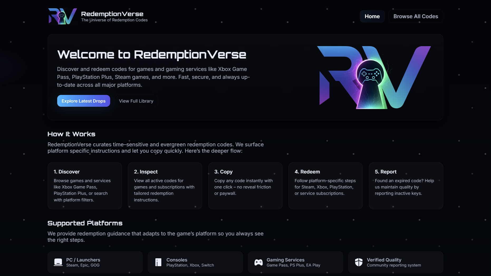
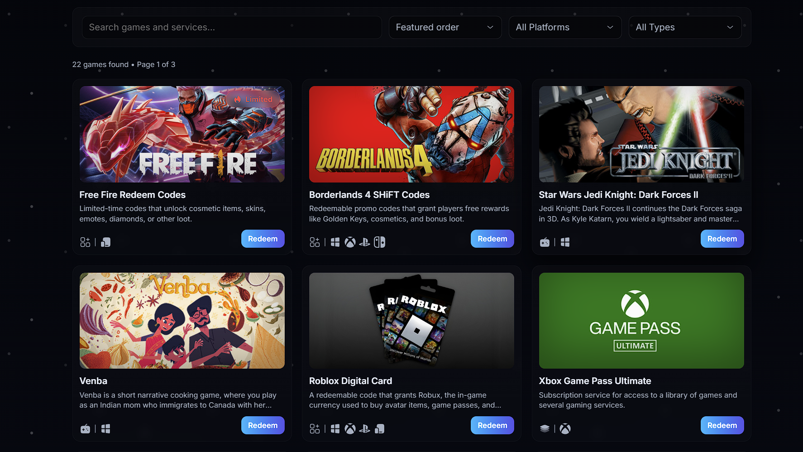

# RedemptionVerse

Discover and redeem codes for games and gaming services (Xbox Game Pass, PlayStation Plus, Steam/PC launchers, digital currency, bundles, and more). This is a fast, static, front‑end experience focused on clarity, accessibility, and zero back‑end dependencies.

---
## Table of Contents
- [Live Preview / Usage](#live-preview--usage)
- [Features](#features)
- [Project Structure](#project-structure)
- [Data Model](#data-model)
- [UI Architecture](#ui-architecture)
- [Accessibility (A11y)](#accessibility-a11y)
- [Content Maintenance](#content-maintenance)
- [Styling & Theming](#styling--theming)
- [Report Flow](#report-flow)
- [Performance Notes](#performance-notes)
- [Deployment](#deployment)
 - [Screenshots](#screenshots)
- [Contributing](#contributing)
- [Privacy & Data](#privacy--data)
- [Disclaimer](#disclaimer)

---
## Live Preview / Usage
Pure static site — no build needed.

1) Open locally
- Clone/download the repo
- Double‑click `index.html` (or drag into your browser)

2) Optional local server (recommended for consistent paths)
```bash
npx serve .
```
Then visit the shown http://localhost:PORT.

---
## Features
- Polished landing page with hero, How It Works, platforms, latest drops, FAQ, and final call‑to‑action.
- Full library page (`all-codes.html`) with:
  - Debounced search
  - Custom ARIA listboxes for Sort, Platform, Type, and Report Reason
  - Pagination with ellipsis compaction
  - Responsive grid + empty state with inline “Clear Filters”
- Redeem modal:
  - Codes + platform/game‑specific Instructions in tabbed panels
  - Description and platform badges (PC, Xbox, PlayStation, Switch, etc.)
  - Segmented two‑tab switch with a shared sliding gradient highlight that moves on hover and when switching tabs
- Copy buttons with optimistic checkmark feedback
- Report modal with multi‑select checkboxes, custom reason listbox, and inline validation
- Theming via CSS variables; accessible, keyboard‑friendly interactions
- Vanilla HTML/CSS/JS only — no external JS dependencies

---
## Project Structure
```
index.html          # Landing / marketing
all-codes.html      # Full library (search / filters / pagination)
style.css           # Global design system + layout + shared components
games.css           # Library page, modal, listboxes, pagination, badges
games.js            # Data, rendering, filtering, modals, reporting, tabs
assets/             # Images / logos / covers
```

---
## Data Model
All data lives in `games.js`.

### Games Array
```js
{
  id: Number,              // unique identifier
  title: String,           // display title
  desc: String,            // short description
  cover: String,           // image path or URL
  platform: String,        // comma-separated list (e.g. "PC, Xbox, PlayStation")
  type: 'Game' | 'Service' | 'In-game item'
}
```

### Codes Map
```js
const codes = {
  [gameId]: [
    { code: String, expired: Boolean },
    // ...more objects
    0 // sentinel at the end (truthy → all codes considered expired)
  ]
}
```
Notes:
- If there’s no array or there are no non‑expired codes, the modal shows a fallback.
- The final array element is a sentinel used in rendering (present and truthy = treat as all expired).

### Instructions
- `baseInstructions`: common flows keyed by platform tokens (e.g., `PC`, `Xbox`, `PlayStation`, `Switch`, `Multi`, `steam`, `gog`).
- `gamesInstructions`: overrides keyed by `id`, each mapping one or more platform/context labels (e.g., `Browser`, `Battle.net App`, `All Platforms`) to an ordered list of steps (strings with limited allowed HTML).

---
## UI Architecture
| Layer | Responsibility |
| --- | --- |
| HTML | Semantic sections, headings, nav, modals. |
| CSS (`style.css`) | Global theme, layout, shared components, controls. |
| CSS (`games.css`) | Filters shell, pagination, listboxes, modal details, badges, tabs. |
| JS (`games.js`) | Data, render pipeline, filtering, pagination, modals, report flow, listbox a11y, tab switching. |

Render cycle: `render()` applies filters, paginates, injects cards, binds events, and updates meta + pagination.

Tabs: two buttons (`Codes`, `Instructions`) with ARIA roles. A shared `.tab-highlight` element slides between them on hover and activation for a smooth, tactile feel.

---
## Accessibility (A11y)
- Custom listboxes use `role="listbox"`, `aria-activedescendant`, `aria-selected`, and support Enter/Space, Arrow keys, and Escape to collapse.
- Results bar uses `aria-live="polite"` for status updates.
- Modals use `aria-modal="true"`, return focus on close, and allow Escape to dismiss.
- Tabs use `role="tablist"`, `role="tab"`, `role="tabpanel"` with Arrow/Home/End key support.
- Screen‑reader‑only utility (`.sr-only`) keeps headings/anchors accessible.

---
## Content Maintenance
### Add a Game/Service
1. Append an object to `games` with a new `id`.
2. Optionally add codes to `codes[id]`.
3. Optionally add `gamesInstructions[id]` entries.
4. Place artwork in `assets/` or use a remote URL.

### Update Codes
Append/remove objects in `codes[id]` (set `expired: true` when applicable). Reopen the modal or call `render()` to see changes.

### Expire/Prune
Remove items or mark them expired; use the sentinel if all are expired.

---
## Styling & Theming
Core variables in `:root` within `style.css`:
```css
--bg, --text, --panel, --glass, --accent1, --accent2, --muted,
--glass-border, --radius, --glass-blur
```
Adjust accent RGB tuples to re‑skin quickly. Components use layered translucent backgrounds for a glassy aesthetic. A special `.limited` pill badge is available for “Limited/Hot/New” tags with gradient, icon, and optional shine.

---
## Report Flow
1. Open the Redeem modal → click “Report”.
2. Codes list populates dynamically; select one or more.
3. Choose a reason (custom listbox) and optionally add comments.
4. Submit triggers a simulated async handler and success feedback (replace with a real API when ready).

Payload shape (example):
```js
{
  gameId, codes: ["..."], reason, comments, timestamp
}
```

---
## Performance Notes
- No external libraries → small footprint.
- Batched DOM updates per page; adaptive pagination.
- Mixed local/remote images; consider `loading="lazy"` if switching to `` tags inside the grid.

---
## Deployment
Because it’s static, you can host on any static provider (GitHub Pages, Netlify, Vercel, etc.). For GitHub Pages:

1. Push the repository to GitHub
2. In repo Settings → Pages, set Source to `main` and root folder
3. Wait for the build; Pages will publish your site URL

---
## Screenshots





---
## Contributing
1. Fork the repo
2. Create a feature branch: `feat/your-change`
3. Commit with clear messages
4. Open a PR with rationale and screenshots for UI changes

Coding style: keep vanilla JS, semantic HTML, and ARIA integrity. Avoid adding frameworks unless the scope changes.

---
## Privacy & Data
- No tracking scripts
- All logic runs client‑side only
- Reports currently log to the browser console (no data leaves the device)

If you later add telemetry or a backend, document it clearly and obtain consent where applicable.

---
## Disclaimer
RedemptionVerse is an independent project and is not affiliated with, endorsed by, or sponsored by any publishers, platforms, or service providers mentioned. Logos, trademarks, and brand names are the property of their respective owners. Sample codes may be placeholders or expired and are for demonstration purposes.

---
## License
This project is licensed under the MIT License — see the [`LICENSE`](LICENSE) file for details.

---
## Maintenance Checklist
- [ ] Prune expired codes
- [ ] Add new game/service entries
- [ ] Verify platform instructions
- [ ] Run a manual accessibility pass (keyboard + screen reader)

---
## Support
Have a question or want an enhancement? Open an issue or start a discussion.

Enjoy exploring the universe of redemption codes ✨
